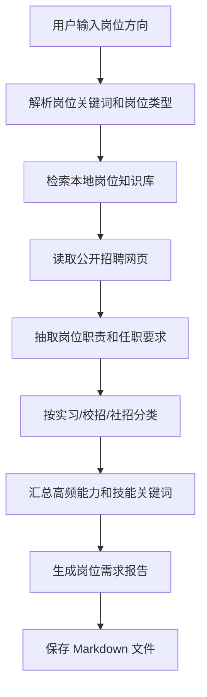

# PRD：AI Agent 岗位搜索助手

## 1. 产品定位

AI Agent 岗位搜索助手是一个面向应届生、实习生和计算机专业研究生的岗位需求研究工具。用户输入岗位方向后，系统优先读取公司招聘官网和公开招聘页面，结合本地岗位知识库，输出一份结构化岗位需求报告。

项目基于现有 LLM + MCP + RAG 技术底座改造：

- LLM 负责理解任务、抽取岗位要求和生成报告。
- RAG 负责复用本地岗位知识库和历史资料。
- MCP Fetch 负责读取公开网页。
- MCP Filesystem 负责保存 Markdown 报告。

## 2. 目标用户

- 正在寻找 AI 产品经理、AI Agent 产品经理、大模型产品经理岗位的研究生。
- 准备投递实习、校招岗位的计算机相关专业学生。
- 希望快速了解不同岗位类型要求差异的求职者。
- 希望用 AI Agent 原型验证求职信息检索场景的 AI 产品经理候选人。

## 3. 用户痛点

- 岗位信息分散在公司官网、校招官网、招聘软件和社交媒体中。
- 用户难以区分实习、校招、社招岗位要求的差异。
- 普通搜索结果噪声大，用户需要手动整理技能要求和项目要求。
- 求职者不知道如何把自己的项目经历对应到岗位要求上。
- 招聘软件存在登录、反爬和数据授权限制，不适合直接批量抓取。

## 4. MVP 范围

### 包含

- 支持输入岗位关键词，如 AI 产品经理、大模型产品经理、AI Agent 产品经理。
- 支持岗位类型分类：实习 internship、校招 campus、社招 experienced。
- 支持公开网页读取，优先使用公司招聘官网和公开招聘页面。
- 支持本地岗位知识库检索。
- 支持生成岗位需求 Markdown 报告。
- 支持输出能力要求、技能关键词、项目经历要求和简历优化建议。

### 不包含

- 不实现招聘软件登录态抓取。
- 不绕过反爬机制。
- 不批量抓取非公开数据。
- 不实现完整前端界面。
- 不实现自动投递。

## 5. 核心流程

## 6. 输出报告结构

- 岗位搜索概览
- 实习 / 校招 / 社招岗位差异
- 高频能力要求
- 高频技术关键词
- 常见项目经历要求
- 对计算机研究生的简历优化建议
- 当前项目可包装的匹配点
- 信息来源和待补充来源

## 7. 产品指标

- 任务完成率：是否成功生成岗位需求报告。
- 来源覆盖数：报告中引用的公开来源数量。
- 岗位分类准确率：岗位是否正确归类为实习、校招或社招。
- 要求抽取完整度：职责、任职要求、技能关键词是否完整。
- 报告可用率：用户是否能直接用于简历优化或面试准备。
- 人工补充率：需要用户手动补充来源的比例。

## 8. 合规边界

- 只读取公开可访问页面。
- 招聘软件信息仅支持公开链接解析或用户手动粘贴 JD。
- 不模拟登录，不绕过验证码，不绕过反爬限制。
- 对不可访问来源明确标注，不编造岗位事实。

## 9. 后续路线图

### V0.1：当前 Demo

- 基于本地岗位知识库生成岗位需求报告。
- 支持 Fetch MCP 读取公开网页。
- 支持 Filesystem MCP 保存 Markdown 报告。

### V0.2：岗位来源管理

- 增加公司招聘官网入口清单。
- 支持用户手动粘贴岗位 JD。
- 增加来源可信度标记。

### V0.3：简历匹配

- 支持用户粘贴简历或项目经历。
- 输出岗位匹配度、差距分析和补强建议。
- 生成针对实习、校招、社招的不同简历表达。

### V1.0：求职研究助手

- 支持多岗位对比。
- 支持岗位趋势报告。
- 支持持续追踪目标公司岗位变化。

