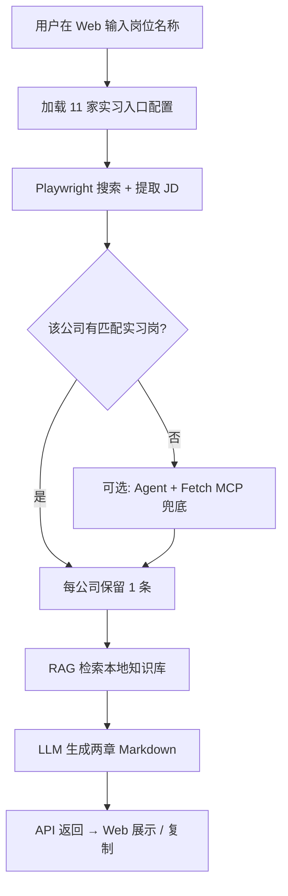

# PRD：AI Agent 实习岗位搜索助手

## 1. 产品定位

AI Agent 实习岗位搜索助手是一个面向计算机专业研究生、AI 产品经理实习求职者的岗位需求研究工具。

用户输入岗位名称后，系统从 **11 家大厂公开实习入口** 检索匹配 JD，结合 **本地岗位知识库（RAG）**，在 Web 页面输出 **可直接复制的两章 Markdown 报告**。

技术底座：

| 组件 | 职责 |
|------|------|
| LLM | 理解任务、合并上下文、生成报告 |
| RAG | 召回 `knowledge/jobs/` 本地岗位知识 |
| Playwright | 渲染动态招聘页，抓取 11 家实习入口 |
| MCP Fetch | Playwright 无结果时，Agent 兜底读取公开页面 |

**当前版本不写本地文件**，报告由 API 直接返回前端展示。

## 2. 目标用户

- 准备投递 AI 产品经理、大模型产品经理、AI Agent 产品经理 **实习** 的研究生
- 计算机、软件工程、人工智能相关专业，需要快速了解某实习岗位要求的学生
- 希望用可演示 Agent 原型展示产品设计能力的 AI 产品经理候选人

## 3. 用户痛点

- 实习 JD 分散在 11 家大厂官网，搜索只能得到链接列表
- 用户难以从多条 JD 中归纳共性能力要求与简历优化方向
- 招聘平台（BOSS、拉勾等）有登录与反爬限制，不适合 V1 批量接入
- 普通 LLM 聊天无法保证引用真实官网 JD，容易编造

## 4. MVP 范围

### 包含

- Web UI：岗位方向（可选）+ 岗位名称输入，报告展示与一键复制
- **11 家大厂实习入口**抓取（见 `knowledge/sources/career_portals.json`）
- 用户输入关键词驱动官网搜索（非硬编码岗位名）
- **仅实习**：`CAREER_INTERNSHIP_ONLY=1`，岗位标题须含「实习」
- 每家公司最多 1 条匹配；匹配数为 0 的公司不写入报告
- 本地岗位知识库 RAG 检索
- Playwright 失败时 Agent + Fetch MCP 降级
- 两章 Markdown 报告直接返回，不写磁盘

### 不包含

- 校招 / 社招岗位检索（V1 聚焦实习）
- 招聘软件登录态抓取
- 绕过验证码或反爬机制
- 报告保存为本地 `.md` 文件
- 自动投递简历

## 5. 11 家大厂实习入口

| # | 公司 | 配置字段 |
|---|------|----------|
| 1 | 字节跳动 | `channel: internship` |
| 2 | 腾讯 | `channel: internship` |
| 3 | 阿里巴巴 | `channel: internship` |
| 4 | 美团 | `channel: internship` |
| 5 | 百度 | `channel: internship` |
| 6 | 华为 | `channel: internship` |
| 7 | 京东 | `channel: internship` |
| 8 | 网易 | `channel: internship` |
| 9 | 小米 | `channel: internship` |
| 10 | 商汤科技 | `channel: internship` |
| 11 | 科大讯飞 | `channel: internship` |

环境变量：

```bash
ENABLE_AUTO_CAREER_FETCH=1
CAREER_FETCH_MAX_SOURCES=11
CAREER_INTERNSHIP_ONLY=1
ENABLE_PLAYWRIGHT_FETCH=1
ENABLE_FETCH_MCP=1
CAREER_AGENT_FALLBACK=1
```

## 6. 核心流程



### 抓取规则

- 搜索词 = 用户输入的 **具体岗位名称**（如「AI产品经理」）
- 岗位标题必须含「实习」（含「日常实习」「实习生」等）
- 非实习岗位过滤；匹配 0 条的公司跳过
- 动态 SPA 页面优先 Playwright；失败走 Agent fallback

## 7. 输出报告结构

报告固定 **两章**，LLM 直接输出正文，不使用文件工具：

### 第一章：公开招聘官网岗位（核心 JD）

- 公司、岗位名、地点、岗位类型
- 岗位职责、招聘条件 / 要求
- 每条必须标注来源 URL
- 只写 context 中已抓到的岗位，不编造

### 第二章：结合本地岗位知识库归纳（能力要求与求职洞察）

- 综合第一章官网条件 + RAG 召回内容
- 输出实习能力要求、技术栈、项目经历、简历优化建议
- 不得原样堆砌知识库，不得捏造未出现的公司在招岗位

**不包含**：校招/社招对比章节、信息来源附录、保存路径说明。

## 8. 产品指标

| 指标 | 定义 |
|------|------|
| 任务完成率 | 用户提交后是否成功返回可复制报告 |
| 来源覆盖数 | 11 家入口中有匹配 JD 的公司数量 |
| 实习过滤准确率 | 非实习岗位被正确排除的比例 |
| 要求抽取完整度 | 职责、条件、URL 字段完整度 |
| 降级触发率 | Playwright 失败后 fallback 触发比例 |
| 报告可用率 | 用户能否直接用于简历优化 |

## 9. 合规边界

- 只读取公开可访问的公司招聘官网
- 不模拟登录，不绕过验证码，不绕过反爬
- 对不可访问来源记录失败原因，不编造岗位
- 本地知识库内容在第二章作为「归纳参考」，不表述为某家公司当前在招事实

## 10. 版本路线图

### V0.2（当前）

- ✅ 11 家大厂实习入口 + Playwright 抓取
- ✅ 仅实习过滤 + 用户关键词搜索
- ✅ 两章报告结构
- ✅ Web UI + 阿里云 Docker 部署
- ✅ 报告直接复制，不写文件
- ✅ Agent + Fetch MCP 降级
- 🔄 腾讯 / 美团 / 京东等站点抓取成功率持续提升

### V0.3

- 用户手动粘贴 JD 作为补充来源
- 来源可信度与时间戳标记
- 抓取成功率监控面板

### V1.0

- 简历 vs 岗位要求 gap 分析
- 多岗位对比
- 历史报告收藏
