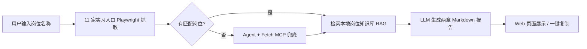

# AI Agent 实习岗位搜索助手

> 基于 LLM + MCP + RAG 的实习岗位需求研究助手，面向计算机专业研究生与 AI 产品经理求职者，从 11 家大厂公开实习入口抓取 JD，结合本地岗位知识库，生成可直接复制的 Markdown 报告。

## 项目定位

本项目基于原有 `LLM + MCP + RAG` 技术底座，产品化为垂直场景 Agent：

**用户输入岗位名称后，系统从 11 家大厂实习招聘入口检索匹配岗位，结合本地岗位知识库，生成两章结构化 Markdown 报告，并在 Web 页面直接展示、一键复制。**

- 聚焦 **实习岗位**（`CAREER_INTERNSHIP_ONLY=1`），岗位标题须含「实习」
- 每家公司最多输出 1 条匹配岗位；匹配数为 0 的公司不写入报告
- **不写入本地文件**，报告正文由 LLM 直接返回前端

## 目标用户

- 计算机、人工智能、软件工程等专业的研究生
- 准备投递 AI 产品经理、大模型产品经理、AI Agent 产品经理 **实习** 的学生
- 希望用 AI Agent 原型展示产品设计能力的 AI 产品经理候选人

## 核心场景

用户在 Web 页面输入：

- **岗位方向**（可选，如「产品」「技术」）
- **具体岗位名称**（如「AI产品经理」「Java后端开发」）

系统返回可直接复制的 Markdown 报告，包含：

1. **第一章**：各公司官网实习岗位 JD（公司、岗位名、地点、职责、条件、来源 URL）
2. **第二章**：结合本地知识库的能力要求、技术栈、项目经历与简历优化建议

## 11 家大厂实习入口

配置见 [`knowledge/sources/career_portals.json`](./knowledge/sources/career_portals.json)：

| 公司 | 入口类型 |
|------|----------|
| 字节跳动 | 日常实习 |
| 腾讯 | 日常实习 |
| 阿里巴巴 | 日常实习 |
| 美团 | 日常实习 |
| 百度 | 日常实习 |
| 华为 | 日常实习 |
| 京东 | 日常实习 |
| 网易 | 日常实习 |
| 小米 | 日常实习 |
| 商汤科技 | 日常实习 |
| 科大讯飞 | 日常实习 |

搜索关键词 **仅使用用户输入的岗位名称**，不会硬编码或拼接固定岗位词。

## 产品痛点

- 实习 JD 分散在各家大厂官网，普通搜索只能返回链接
- 用户难以快速归纳「这个岗位到底要什么能力」
- 招聘平台存在登录与反爬限制，不适合作为 V1 批量数据源
- 求职者需要把岗位要求转化为可执行的简历优化计划

## 解决方案

| 能力 | 作用 |
|------|------|
| **Playwright 抓取** | 渲染动态招聘页，从 11 家实习入口搜索并提取 JD |
| **Agent + Fetch MCP 兜底** | Playwright 无结果时，由 LLM 通过 Fetch MCP 读取公开页面 |
| **RAG** | 召回 `knowledge/jobs/` 下本地岗位知识库，用于第二章归纳 |
| **LLM Agent** | 合并官网 JD 与知识库，生成两章 Markdown 报告 |

整体流程：



## MVP 功能

- Web UI：岗位方向 + 岗位名称输入，报告展示与复制
- 11 家大厂实习入口自动抓取（Playwright + 站点适配器）
- 岗位标题含「实习」过滤；每公司 1 条；0 匹配跳过
- 用户输入关键词驱动官网搜索（非硬编码岗位）
- 本地岗位知识库 RAG（`knowledge/jobs/`）
- Playwright 失败时 Agent + Fetch MCP 降级
- 直接输出可复制 Markdown，不写本地文件

## 报告结构

固定两章，顺序不可变：

### 一、公开招聘官网岗位（核心 JD）

各公司具体实习岗位：公司、岗位名、地点、岗位类型、职责、招聘条件；每条标注来源 URL。

### 二、结合本地岗位知识库归纳（能力要求与求职洞察）

综合第一章官网条件与本地知识库，输出实习能力要求、技术栈倾向、项目经历与简历优化建议。

## 合规边界

- 只读取 **公开可访问** 的公司招聘官网页面
- 不绕过 BOSS/拉勾等平台的登录、验证码或反爬机制
- 不编造 context 中未出现的岗位事实
- 匹配数为 0 的公司不写入报告

## 项目文档

- [AI_JOB_AGENT_PRD.md](./AI_JOB_AGENT_PRD.md)：产品需求文档
- [AI_JOB_AGENT_DEMO_CASE.md](./AI_JOB_AGENT_DEMO_CASE.md)：Demo Case
- [AI_JOB_AGENT_RESUME_PROJECT.md](./AI_JOB_AGENT_RESUME_PROJECT.md)：简历项目经历模板
- [knowledge/jobs/ai_product_manager/roles.md](./knowledge/jobs/ai_product_manager/roles.md)：岗位知识库样例

## 技术实现

核心模块：

- `careerPortalFetcher` / `careerJobSearch`：11 家实习入口抓取与关键词搜索
- `careerPortalAdapters` / `careerPortalCollectors`：各站点 HTML/API 适配
- `careerAgentFallback`：Playwright 无结果时的 Agent + Fetch 兜底
- `careerContextMerger`：合并官网 JD 与 RAG 上下文
- `Agent` / `ChatOpenAI` / `MCPClient`：LLM 工具调用与报告生成
- `EmbeddingRetriever` / `VectorStore`：本地知识库向量检索（内存，不落盘）

技术栈：TypeScript · Node.js · Playwright · OpenAI-compatible API · MCP · RAG

## 本地运行

```bash
pnpm install
cp .env.example .env
# 编辑 .env 填入 OPENAI_API_KEY、EMBEDDING_KEY 等
pnpm dev
```

浏览器访问 `http://localhost:9000`。

关键环境变量（完整见 `.env.example` 与 `deploy/aliyun/.env.prod.example`）：

```bash
ENABLE_AUTO_CAREER_FETCH=1
CAREER_FETCH_MAX_SOURCES=11
CAREER_INTERNSHIP_ONLY=1
ENABLE_PLAYWRIGHT_FETCH=1
ENABLE_FETCH_MCP=1          # Agent fallback 需要
CAREER_AGENT_FALLBACK=1
RAG_TOP_K=8
CONTEXT_MAX_CHARS=15000
```

说明：

- `CAREER_INTERNSHIP_ONLY=1`：只保留 `channel: internship` 的入口，且岗位标题须含「实习」
- Playwright 本地若 Chromium 安装失败，可设 `PLAYWRIGHT_CHANNEL=msedge`
- 报告 **不写入** `output/`，由 API 直接返回 Markdown 字符串

构建：

```bash
pnpm build
pnpm start
```

## 部署到阿里云（ECS + Docker）

```bash
git clone https://github.com/sk08lee/AI-JD-search-agent.git
cd AI-JD-search-agent
cp deploy/aliyun/.env.prod.example deploy/aliyun/.env.prod
# 编辑 deploy/aliyun/.env.prod
bash deploy/aliyun/build-and-run.sh 9000
```

代码更新后需 **重新构建 Docker 镜像**（`public/`、`dist/` 在构建时打入镜像）：

```bash
git pull origin main
bash deploy/aliyun/build-and-run.sh 9000
```

### 已提供的部署文件

- `deploy/aliyun/docker-compose.ecs.yml`：单容器编排
- `deploy/aliyun/deploy-ecs.sh`：部署脚本
- `deploy/aliyun/build-and-run.sh`：本地构建 + 启动
- `deploy/aliyun/.env.prod.example`：生产环境变量模板
- `deploy/aliyun/docker-compose.nginx.yml` / `deploy-nginx.sh`：Nginx + HTTPS（可选）

GitHub Actions 自动发布见 `.github/workflows/deploy-aliyun-ecs.yml`。

## 本地知识库

RAG 数据源为 `knowledge/` 目录下的 Markdown 文件（非传统数据库）：

| 路径 | 说明 |
|------|------|
| `knowledge/jobs/ai_product_manager/roles.md` | AI 产品经理 |
| `knowledge/jobs/software_engineer/roles.md` | 软件工程师 |
| `knowledge/jobs/data_analyst/roles.md` | 数据分析师 |
| `knowledge/jobs/general/common_skills.md` | 通用技能（兜底） |
| `knowledge/sources/career_portals.json` | 11 家实习入口配置 |

向量在运行时生成并保存在内存中，进程结束后清空。

## 产品指标

- **任务完成率**：是否成功生成可复制报告
- **来源覆盖数**：11 家入口中有匹配 JD 的公司数
- **实习过滤准确率**：非实习岗位是否被正确排除
- **要求抽取完整度**：职责、条件、来源 URL 是否完整
- **降级触发率**：Playwright 失败后 Agent fallback 的触发比例

## 后续路线图

- 提升腾讯、美团、京东等站点的 Playwright 抓取成功率
- 支持用户手动粘贴 JD 作为补充来源
- 简历与岗位要求 gap 分析
- 多岗位对比与历史报告收藏

## 作品集表达

> 基于 LLM + MCP + RAG 技术底座，独立设计 AI Agent **实习岗位研究助手**：接入 11 家大厂公开实习入口，Playwright 抓取 + Agent 降级，RAG 知识库归纳，Web 部署可演示，报告可直接复制交付。
